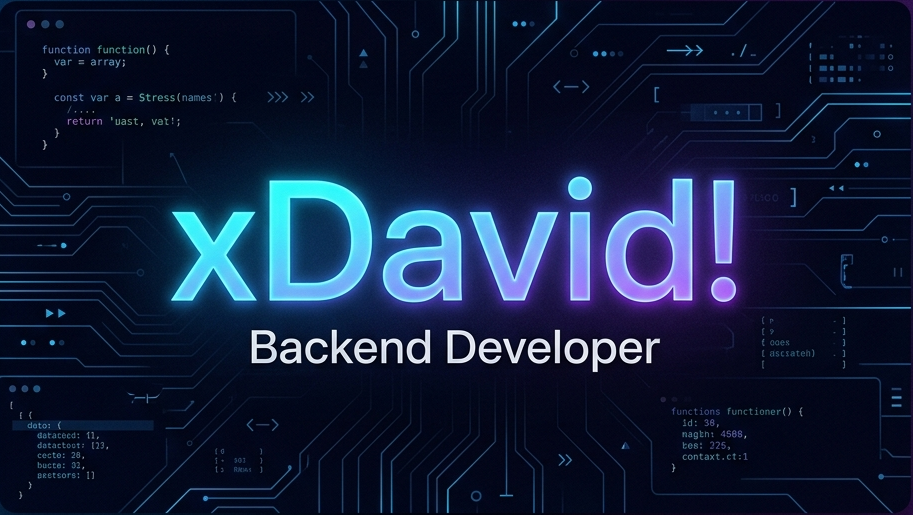

<!-- Banner animado tipo ola con gradiente -->

  

  
### 👋 About Me

*   🧡 **I design software** prioritizing scalability, clean boundaries, and high performance.
*   🔌 **Backend:** C# (.NET 8), ASP.NET Core Web API, Redis caching, Stripe integration.
*   🎮 **Minecraft Ecosystem:** Optimized plugin development, packet manipulation, and custom engine tooling.
*   💾 **Data & Cache:** PostgreSQL (EF Core) and Redis (caching patterns like Cache-Aside, atomicity with Lua scripts).
*   🧪 **Quality:** Automated testing using xUnit and Testcontainers (running real database instances for integration tests).
*   ⚡ **DevOps & Infrastructure:** Docker & Docker Compose setup, structured logging with Serilog, and containerized deployments.

---

### 🛠️ Technologies I Use

  <!-- Fila 1: Lenguajes y Runtimes -->
  
  
  
  
  
   
  <!-- Fila 2: DB, Cache e Infraestructura -->
  
  
  
  
  

  
  
  
  

---

### 📌 Projects I'm Currently Working On

  
<strong>🚀 Ice_backend (C# / .NET 8)</strong>

   
  High-performance backend for the <em>ICE Launcher</em>.
  <ul>
    <li>Auth using Redis sessions & OAuth2 PKCE.</li>
    <li>Cosmetics inventory management.</li>
    <li>Idempotent Stripe Webhooks integration.</li>
    <li>JIT CDN pre-signed URLs.</li>
  </ul>
  <a href="https://github.com/xDavidGamerx/Ice_backend">View Repository</a>

---

### 🎧 Now Playing

  

---

### 🔗 Connect With Me

  &nbsp;
  &nbsp;
  

  <em>Last Updated: June 2026</em>

